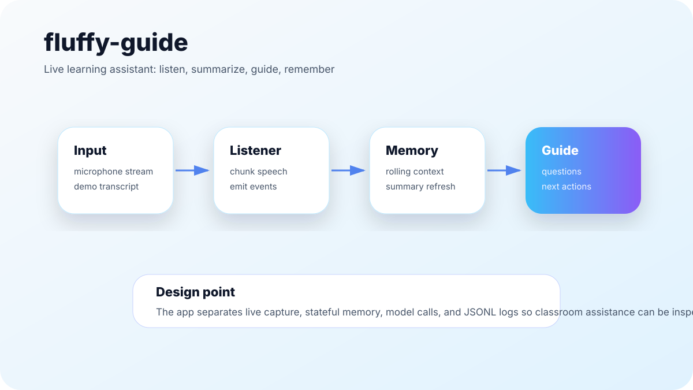
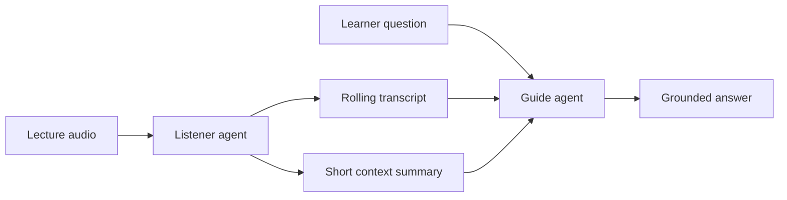

# fluffy-guide

**A real-time multimodal AI copilot for live learning.**

fluffy-guide is a lightweight research prototype that listens to lecture audio, maintains a rolling transcript and summary, and lets a learner ask quiet questions without interrupting the speaker.

The project explores real-time understanding: helping someone keep up while a lecture is happening, instead of only summarizing after the fact.



## What it does

- Captures lecture audio in real time or demo mode.
- Generates a rolling transcript.
- Maintains a short evolving summary of recent context.
- Lets the learner ask questions silently with text or voice.
- Answers using recent lecture context instead of unrelated general knowledge.

## How it works

fluffy-guide uses a two-agent structure:



### Listener agent

- Captures audio.
- Transcribes speech.
- Maintains a rolling context buffer.
- Updates a short summary.

### Guide agent

- Takes learner questions.
- Uses the recent transcript and summary.
- Returns concise grounded answers.

The lecturer is treated as separate from the learner so interaction remains silent and non-disruptive.

## Setup

Clone the repository:

```bash
git clone https://github.com/jayasrisng/fluffy-guide.git
cd fluffy-guide
```

Create and activate a virtual environment:

```bash
python3 -m venv venv
source venv/bin/activate
```

Install dependencies:

```bash
pip install -r requirements.txt
```

Create a `.env` file:

```bash
OPENAI_API_KEY=your_api_key_here
```

Run the app:

```bash
python -m streamlit run app.py
```

## Usage

### Demo mode

- Enable demo mode.
- Start agents.
- Transcript and summary simulate a lecture.

### Live mode

- Disable demo mode.
- Select microphone.
- Play lecture audio near the laptop.

## Example questions

```text
summarize the last 30 seconds
give me another example
what does that mean simply
what did the speaker say about the main tradeoff?
```

## Research direction

This project explores:

- real-time understanding instead of post-hoc summarization;
- continuous multimodal context;
- silent human-AI interaction;
- multi-agent learning support;
- future extensions into XR gaze and spatial interfaces.

## Tech stack

- Python
- Streamlit
- faster-whisper
- OpenAI API

## Case study

See [docs/case-study.md](docs/case-study.md) for product and implementation notes.

## Current limitations

- Demo mode is the most reliable for presentations.
- Live mode depends heavily on microphone quality and room noise.
- Transcription errors can affect downstream answers.
- The app should not be used to record private lectures or meetings without consent.
- API keys and transcripts should be handled as sensitive data.

## Future work

- Add transcript export controls.
- Add consent and privacy prompts for live capture.
- Add better source quoting from recent transcript snippets.
- Add support for lecture slides or visual context.
- Explore XR/spatial interfaces for silent question input.
